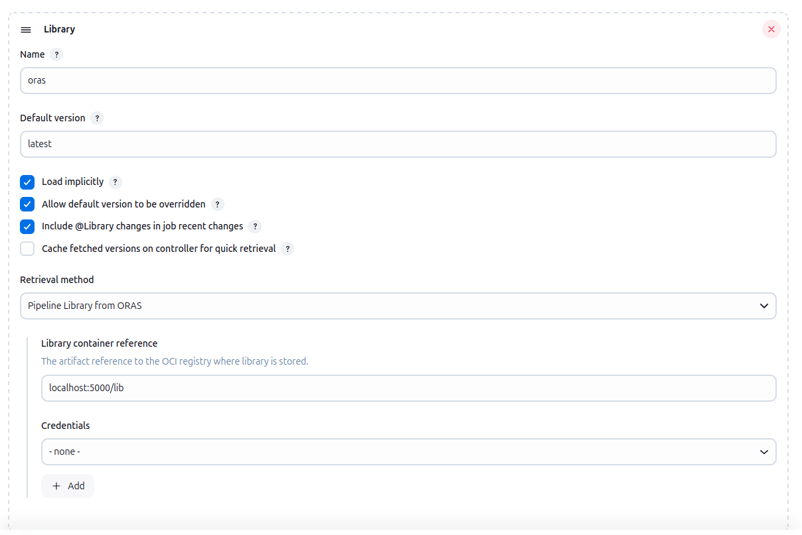
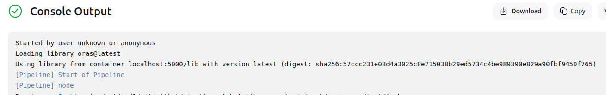

# Pipeline Lib ORAS Plugin

[](https://ci.jenkins.io/job/plugins/job/pipeline-lib-oras-plugin-plugin/)
[](https://plugins.jenkins.io/pipeline-lib-oras-plugin/)
[](https://github.com/jenkinsci/pipeline-lib-oras-plugin-plugin/releases/latest)
[](https://github.com/jenkinsci/pipeline-lib-oras-plugin-plugin/graphs/contributors)

## Introduction

This plugin allow to fetch jenkins libraries stored into an OCI compliant registry (ORAS).

> [!WARNING]
> The ORAS Java SDK is currently in **alpha** state and might impact the stability of this plugin.
>
> It's configuration and APIs might change in future releases

<p align="left">
<a href="https://oras.land/"></a>
</p>

## Getting started

When configuring a pipeline job, just select the "Pipeline library from ORAS" option in the "Library" section.

Credentials are optional if using an unsecured registry. Otherwise you need to provide a username/password credential.



In order to consume a library you need to ensure to set the following artifact type `application/vnd.jenkins.lib.manifest.v1+json`

You can push such an artifact using the [ORAS CLI](https://oras.land/docs/commands/oras_push):

```bash
oras push localhost:5000/hello:latest --artifact-type application/vnd.jenkins.lib.manifest.v1+json my-lib
```

When pushing a directory to oras, the `src`, `vars`, and `resources` can be set under a unique directory name, for example `my-lib` in the above command.

You will see then on the logs the digest of the library



## LICENSE

Licensed under MIT, see [LICENSE](LICENSE.md)

